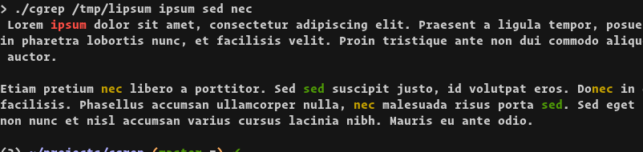

# cgrep

Wrapper around (e)grep to match multiple patterns, output the whole searched file and hightlight the search matches.

## Usage

```
make
./cgrep filepath pattern[, pattern2[, pattern3[, ...]]]
```

## Example



## Improvements

- Make colors configurable
- Add random colors when there are more patterns than available colors?
- Allow cgrep to worked when piped (to read stdin)
